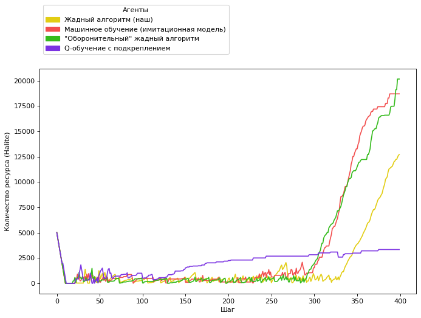
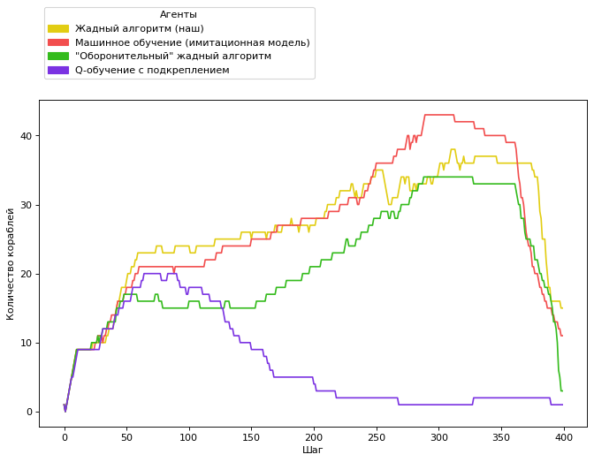
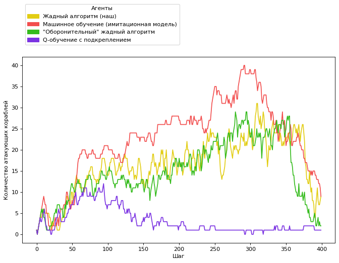

# Halite Bot. For competition by Kaggle and TwoSigma
Repository includes analysis and comparison with other bots

## Project description
This is a Halite bot implemented in Python using greedy algorithm strategies and rule-based logic. You can find the source code [in this folder](halite-greedy-algorithm-bot/)

Halite by Two Sigma ("Halite") is a resource management game where you build and control a small armada of ships. Your algorithms determine their movements to collect halite, a luminous energy source. The most halite at the end of the match wins, but it's up to you to figure out how to make effective and efficient moves. You control your fleet, build new ships, create shipyards, and mine the regenerating halite on the game board.

Read the [kaggle page](https://www.kaggle.com/c/halite) for more

## Approach
To analyze our bot's performance and strategy against other bots as well as the performance of the greedy algorithm we've implemented, other bots' source code is also included.

Bots
| Order: Color                                                               | Bot AI type      | Folder                                    | Lines  |
| ---------------------------------------------------------------------------|:----------------:| :----------------------------------------:| -----:|
| #1:  Yellow | Greedy Algorithm | [source](./halite-greedy-algorithm-bot/)  | ~1K |
| #2:  Red    | Machine Learning | [source](./halite-imitation-learning-bot/)| ~2.4K |
| #3:  Green    | Defensive Greedy Algorithm | [source](./halite-defensive-greedy-algorithm-bot/)| ~4.4K |
| #4:  Purple    | Q-Learning | [source](./halite-q-learning-bot/)| ~1.3K |

## Analysis

#### Halite amount
Halite amount of each player over the course of the game


#### Alive ships
Alive ships of each player over the course of the game


#### Attack ships
Attack ships of each player over the course of the game


## Setup and requirements
 - [Python 3.8+](python.org)
 - Run `pip install -r requirements.txt`
 
## Running the simulation and building graphs
Run `run.py` and provide the steps parameter
```python
$ python run.py 400
```
Watch the game by opening `simulation.html`
 
### Used [libraries](requirements.txt)
 - [kaggle_environments](https://github.com/Kaggle/kaggle-environments)
 - [numpy](https://numpy.org/)
 - [torch](https://pytorch.org/)
 - [scipy](https://www.scipy.org/)
 - [matplotlib](https://matplotlib.org/)
 - [IPython](https://ipython.org/)
